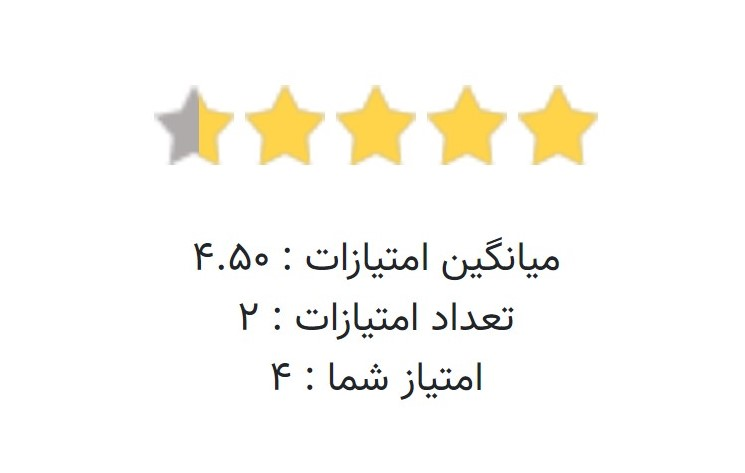

# django-star-ratings-farsi

Python 3 compatible Farsi ratings for Django.

Add ratings to any Django model with a template tag.

Requirements
-

* Python 3.6+.
* Django 2.2+


Installation
-
+ copy repository to project folder.

+ add `star_ratings` to `INSTALLED_APPS` in `settings.py`:
```
INSTALLED_APPS = [
        'star_ratings'
    ]
```

+ run `python manage.py migrate`

+ add the following to your `urls.py` :
```
path('ratings/', include('star_ratings.urls', namespace='ratings')),
```

Make sure ``'django.core.context_processors.request',`` is in
``TEMPLATE_CONTEXT_PROCESSORS``.

Usage
-
Add the following javascript and stylesheet to your template
```

<head>
<link rel="stylesheet" href="">
<script type="text/javascript" src=""></script>
</head>
```

To enable ratings for a model add the following tag in your template
```

<body>

<p> show ratings section </p>
 

<p> show ratings info </p>

{{rate.total}}
{{rate.count}}
{{rate.average}}
{{rate.percentage}}
{{rate.content_type}}
{{rate.object_id}}
{{rate.content_object.title}}

</body>
```
Template tags
-

The template tag takes four arguments:

-  `icon_height`: defaults to `STAR_RATINGS_STAR_HEIGHT`
-  `icon_width`: defaults to `STAR_RATINGS_STAR_WIDTH`
-  `read_only`: overrides the `editable` behaviour to make the widget read only
-  `template_name`: overrides the tempalte to use for the widget

Settings
-

To prohibit users from altering their ratings set
`STAR_RATINGS_RERATE = False` in settings.py

To allow users to delete a rating by selecting the same score again, set
`STAR_RATINGS_RERATE_SAME_DELETE = True` in settings.py, note
that `STAR_RATINGS_RERATE` must be True if this is set.

To allow uses to delete a rating via a clear button, set
`STAR_RATINGS_CLEARABLE = True` in settings.py. This can be used
with or without STAR_RATINGS_RERATE.

To change the number of rating stars, set `STAR_RATINGS_RANGE`
(defaults to 5)

To enable anonymous rating set `STAR_RATINGS_ANONYMOUS = True`.

Please note that `STAR_RATINGS_RERATE`, `STAR_RATINGS_RERATE_SAME_DELETE` and  `STAR_RATINGS_CLEARABLE`
will have no affect when anonymous rating is enabled.

Anonymous Rating
-

If anonymous rating is enabled only the ip address for the rater will be stored (even if the user is logged in).
When a user rates an object a preexisting object will not be searched for, instead a new rating object will be created

**If this value is changed your lookups will return different results!**

To control the default size of stars in pixels set the values of `STAR_RATINGS_STAR_HEIGHT` and `STAR_RATINGS_STAR_WIDTH`. By default `STAR_RATINGS_STAR_WIDTH` is the same as `STAR_RATINGS_STAR_HEIGHT` and `STAR_RATINGS_STAR_HEIGHT` defaults to 32.

Changing the star graphics
-

To change the star graphic, add a sprite sheet to `/static/star-ratings/images/stars.png` with the states aligned horizontally. The stars should be laid out in three states: full, empty and active.
You can also set `STAR_RATINGS_STAR_SPRITE` to the location of your sprite sheet.

Customize widget template
-
You can customize ratings widget by creating `star_ratings/widget.html` . For example :
```


 Whatever you want

```
See `star_ratings/widget_base.html` for other blocks to be extended.
